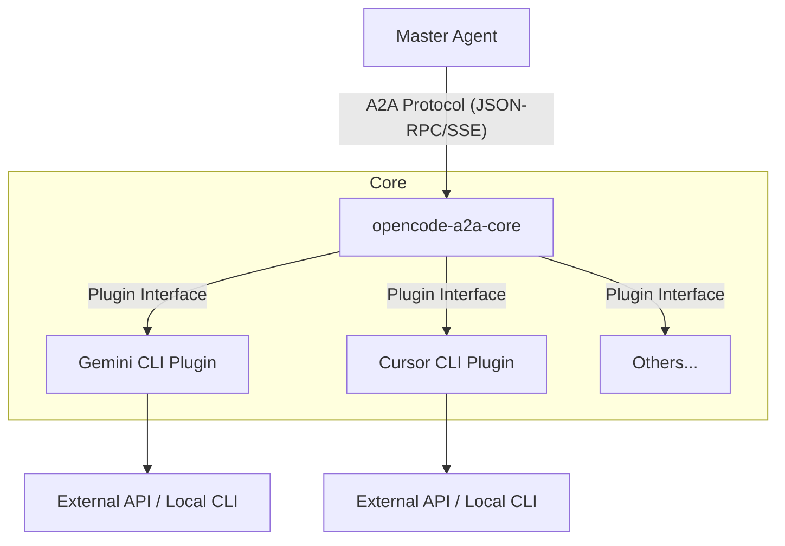

# 🔌 opencode-a2a-core

   

> **OpenCode拡張のためのA2A共通基盤 ＆ プラグインフレームワーク**
> AIエージェントを「APIの薄いラッパー」として統合・駆動するための、堅牢で自律性を持たない（ヘッドレスな）実行エンジン。

## 📖 概要 (Overview)

`opencode-a2a-core` は、マルチエージェント環境（MAS）において頻発する**「意味論的ドリフト（解釈の齟齬）」を防ぐため**に設計された、A2A（Agent-to-Agent）プロトコル通信のコアフレームワークです。

これまで `GeminiCLI` や `CursorCLI` 向けに個別に実装されていた通信・実行ロジックをリファクタリングし、堅牢な**「共通コア基盤」**と、各ツール固有の処理を切り替える**「プラグイン」**へと分割・統合しました。

詳しい仕様については [SPEC.md](./SPEC.md) を参照してください。

### 🧠 設計思想: 主導権集中アプローチ（非対称委任モデル）

本基盤の最大の特徴は、エージェント間連携において**対等な関係を捨て、主導権を完全にマスターエージェントに集中させる**点にあります。

- **👑 エージェントA（Master）**: 推論、計画、ツール選択の全権を握るオーケストレーター。
- **⚙️ エージェントB（Worker / 本システム）**: 独自の推論を持たず、渡された指示を愚直にAPIリクエストへ変換する「薄いラッパー」に徹する。

```text
[ Master Agent (Agent A) ]
       │
       │ (JSON-RPC 2.0 / SSE)
       ▼
┌─────────────────────────────────────────┐
│  opencode-a2a-core (Agent B / Wrapper)  │
│                                         │
│  ├─ HTTP Server Adapter (Hono/RPC)      │
│  ├─ Core Task Runner (Retry / Halt)     │
│  └─ Plugin Interface                    │
│       ├─ Gemini CLI Plugin              │
│       ├─ Cursor CLI Plugin              │
│       └─ Claude Code Plugin             │
└─────────────────────────────────────────┘
       │ (Direct Headless Execution)
       ▼
[ External APIs & Local CLI Tools ]
```

## 🛠 セットアップ (Setup)

### FOR HUMANS (推奨)

AIエージェント（Gemini CLI, Claude Code, Cursor 等）をお使いの場合は、セットアップをエージェントに丸投げすることを推奨します。

> [!TIP]
> 以下のプロンプトをコピーしてエージェントに貼り付けてください。
>
> ```text
> Install and configure opencode-a2a-core. First, read the README.md (https://raw.githubusercontent.com/yohi/opencode-a2a-core/main/README.md) in this repository. You MUST use your interaction tool (e.g., ask_user) to let me choose the installation/plugin configuration method BEFORE executing any other commands.
> ```

### FOR AGENTS

<details>
<summary>AIエージェント向けの手順 (Instructions for AI Agents)</summary>

1.  **Read Context**: 最初に `README.md` を読み、プロジェクトの目的と制約を理解してください。
2.  **Interaction First**: 独断でコマンドを実行せず、必ず `ask_user` 等を使用して、ユーザーにインストール環境やプラグインの設定を確認してください。
3.  **Execute & Build**: ユーザーの承認を得た後、ホスト環境（Node.js 22+ 推奨）で依存関係のインストール (`pnpm install`) およびビルド (`pnpm build`) を実行してください。
4.  **Configure opencode.jsonc**: 本プロジェクトを A2A ゲートウェイとして利用できるようにするため、ユーザーの環境設定ファイル（`opencode.jsonc` 等）に以下の定義を追加することを提案、または実行してください。

```jsonc
"a2a-gateways": {
  "local-core": {
    "endpoint": "http://localhost:3000",
    "token": "your-secret-token",
    "pluginId": "gemini-cli"
  }
}
```

5.  **Verify (Optional)**: テストや開発を行う場合は、**Devcontainer** を起動した上で `pnpm test` を実行してください。

</details>

## ⚙️ 設定 (Configuration)

### A2A ゲートウェイの登録

AIエージェントが本基盤を介してツールを操作するためには、`opencode.jsonc` の `a2a-gateways` セクションにエンドポイントと認証情報を記述する必要があります。

```jsonc
{
  "a2a-gateways": {
    "local-core": {
      "endpoint": "http://localhost:3000",
      "token": "your-secret-token", // 起動時の A2A_AUTH_TOKEN と一致させる
      "pluginId": "gemini-cli"
    }
  }
}
```

## 🏗 アーキテクチャ

本基盤は、エージェント間連携において主導権をマスターエージェントに完全に集中させる「非対称委任モデル」を採用しています。



## ✨ 主な特長 (Key Features)

1. **🔌 柔軟なプラグイン拡張 (Plugin Architecture)**: 共通の `A2APluginInterface` を実装することで、新しいCLIツールやAPIを容易にエージェント網へ組み込むことができます。
2. **🛡️ 型による強固な契約 (Type-Safe Protocol)**: Zodを用いた厳格なスキーマ検証（`Message`, `TaskStatus`, `Artifact`等）により、A2A通信における不正なペイロードを水際でブロックします。
3. **🛑 厳密な自律性制御 (Strict Execution Control)**: 自律的な問題解決（推論の暴走）をシステムレベルで禁止。一時的なエラーはリトライしますが、致命的なエラーは直ちに停止し、マスターへ判断を委ねるフェイルセーフ設計。
4. **🐳 Devcontainer による開発支援**: テストや静的解析など、環境依存を排除したい開発作業のために最適な Devcontainer 環境を提供しています。
5. **🌐 HTTP Server Adapter (Built-in)**: JSON-RPC 2.0 と SSE (Server-Sent Events) に対応した Hono ベースのサーバーアダプタを標準搭載。

## ⚠️ ライセンス

[MIT LICENSE](./LICENSE)
